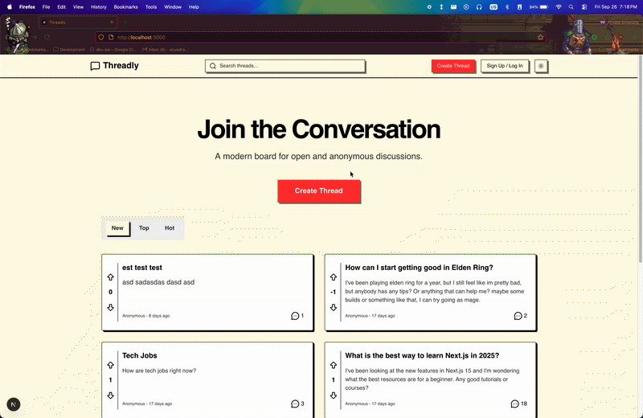

# Threadly 💬

**Threadly** is a modern, feature-rich social discussion board inspired by platforms like Reddit but with a clean, minimalist design. Users can create threads, post replies with a rich text editor, vote on content, and engage in real-time private messaging. This project is a full-stack application built with Next.js and Supabase.
Live: https://threadly-beta.vercel.app/

## ✨ Features

This project is a complete social media platform with a wide range of features:

* **Full User Authentication:**
    * Secure sign-up and log-in flows.
    * Email confirmation for new users.
    * Server-side session management (`@supabase/ssr`) for a flicker-free experience.
    * Protected routes and guest-only routes via Next.js Middleware.

* **Content & Interaction:**
    * Users can create new discussion threads with a rich text editor (Tiptap).
    * Anonymous posting is enabled for both guests and logged-in users.
    * Robust voting system (upvote/downvote) for both threads and comments.
    * Optimistic UI updates for voting, providing an instantaneous user experience.
    * Bookmarking system for users to save their favorite threads.

* **Real-time Functionality:**
    * **Private Messaging:** A complete, real-time chat system between users, built with Supabase Realtime.

* **User Profiles:**
    * Publicly viewable user profiles with stats (thread/post counts) and content tabs.
    * Private profile page for the logged-in user with an "Edit Profile" feature using Server Actions.
